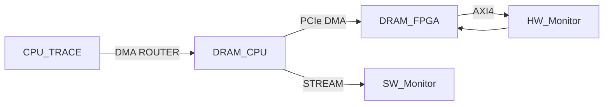

# rtmlib 2

[](https://travis-ci.org/anmaped/rtmlib)

## Description

The RunTime embedded Monitoring Library (rtmlib) has been initially developed for runtime monitoring of real-time embedded systems [1] either for ARM and X86 platforms. rtmlib is a lean library that supports atomic operations on shared memory circular buffers and implements a monitor abstraction layer for infinite sequences of time-stamped symbols or events. This library is used to implement different monitoring architectures such as the ones proposed in [2] and [3]. Other efficient architectures can be deployed based on lock-free push, pull, and pop primitives over infinite trace sequences containing time-stamped events. The synchronization primitives for push, pull, and pop operations allow different readers and writers to progress asynchronously over the instantiated circular buffers and to synchronize when required. Indeed, the rtmlib solves the lock-free producer-consumer problem for circular buffer-based FIFO queues where readers are consumers and writers are producers.

The rtmlib 2 is not just an improved version of rtmlibv0.1 but is also a library that supports hardware synthesis via Vivado HLS tool. The rtmlib can support software and hardware monitoring via dedicated CPU and FPGA devices.

The figure Hybrid Overview shows our new approach.



rtmlib has a direct connection with the rmtld3synth tool as a monitor integration layer. rmtld3synth is a tool that can generate cpp11 monitors and can be implemented in software or hardware.


## How to use rtmlib 2?

See [https://anmaped.github.io/rtmlib/doc/](https://anmaped.github.io/rtmlib/doc/) for more details.

### Run rtmlib 2 examples

See `examples` folder for more details.

### Run rtmlib 2 tests

#### Container (recommended)

Build and run tests with
```
podman build -f Containerfile -t rtmlib-test-img .
```

#### Local

Use the `make` command to build the unit tests.
```
cd tests/
make
```

The expected output might be similar to
```
$ ./rtmlib_unittests 
rtmlib_rmtld3_nested_until.cpp success.
rtmlib_buffer_push_and_pull.cpp success.
rtmlib_buffer_push_and_pop.cpp success.
rtmlib_reader_and_writer.cpp success.

[...]
$
```


## References

[1] de Matos Pedro, A., Pinto, J.S., Pereira, D. et al. Runtime verification of autopilot systems using a fragment of MTL-∫ . Int J Softw Tools Technol Transfer 20, 379–395 (2018). https://doi.org/10.1007/s10009-017-0470-5

[2] Nelissen G., Pereira D., Pinho L.M. (2015) A Novel Run-Time Monitoring Architecture for Safe and Efficient Inline Monitoring. In: de la Puente J., Vardanega T. (eds) Reliable Software Technologies – Ada-Europe 2015. Ada-Europe 2015. Lecture Notes in Computer Science, vol 9111. Springer, Cham. https://doi.org/10.1007/978-3-319-19584-1_5

[3] de Matos Pedro A., Pereira D., Pinho L.M., Pinto J.S. (2014) Towards a Runtime Verification Framework for the Ada Programming Language. In: George L., Vardanega T. (eds) Reliable Software Technologies – Ada-Europe 2014. Ada-Europe 2014. Lecture Notes in Computer Science, vol 8454. Springer, Cham. https://doi.org/10.1007/978-3-319-08311-7_6
