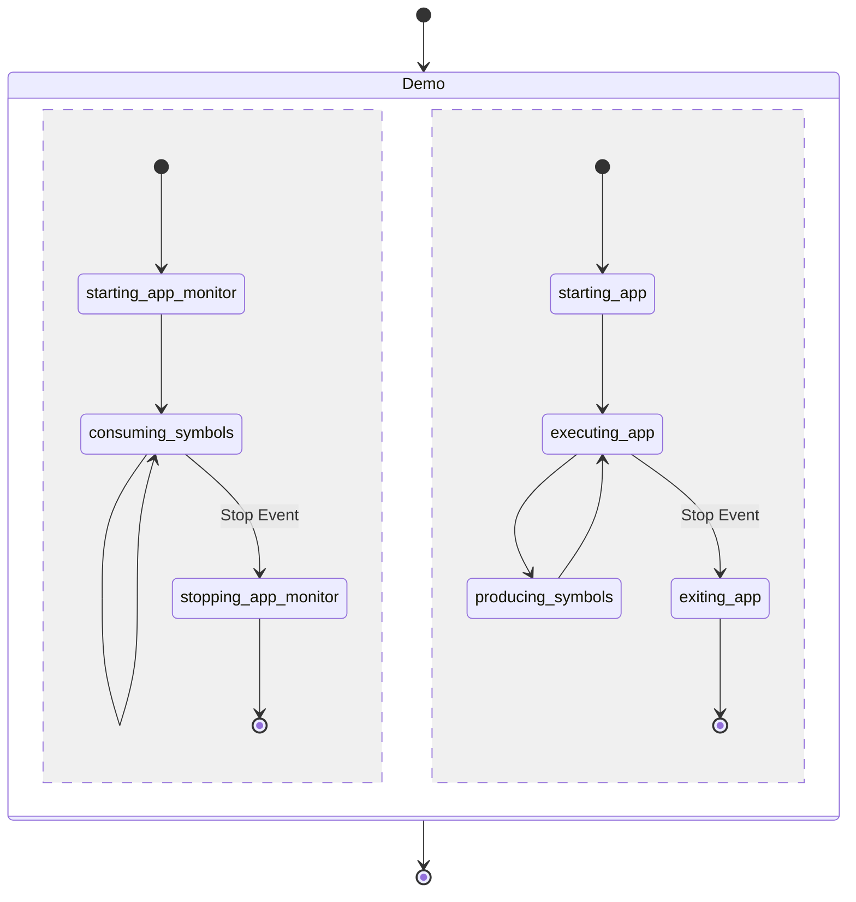

# NuttX Demo

This demo exemplifies how rtmlib couple software monitors with NuttX RTOS on RISC-V architectures.

# Overview

This example, divided into two parts, shows the `app` application (with one task) monitored by the `app-monitor` application (with another task).



# Compile and Run

Run `make` to compile inside `examples/qemu-riscv-virt-nuttx` directory. For dependencies, see the reference [Containerfile](../../Containerfile).

Run QEMU
```
qemu-system-riscv64 -M virt -cpu rv64 -m 512M -smp 8 -monitor none -nographic -serial stdio -bios none -kernel nuttx
```
The NuttX monolithic binary can be found in `./rtmlib/thirdparty/nuttx/nuttx`.
