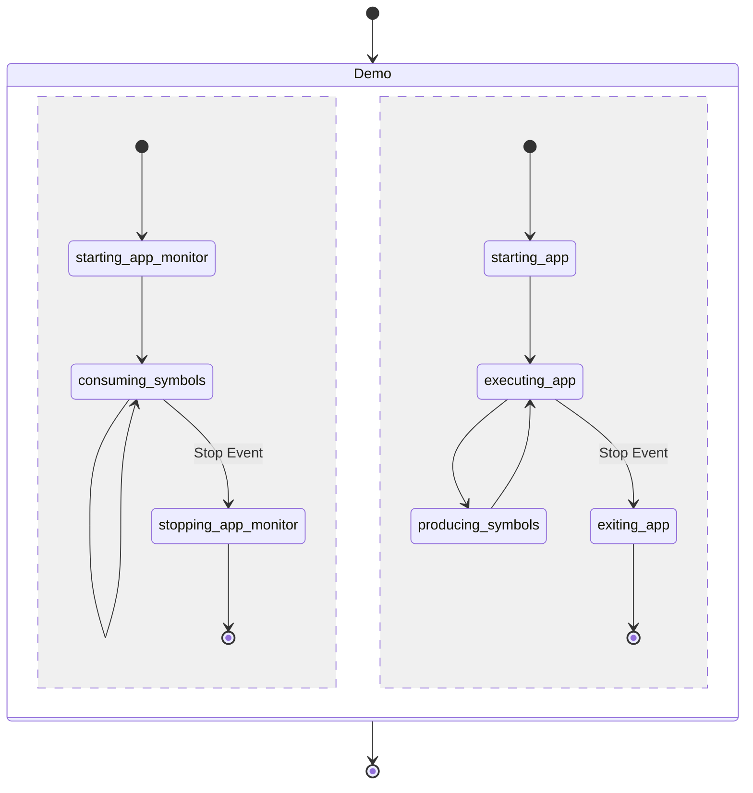

# NuttX Demo

This demo exemplifies how rtmlib couples software monitors with NuttX RTOS on RISC-V architectures.

# Overview

This example, divided into two parts, shows the `app` application (with one task) monitored by the `monitor-app` application (with another task).



# Compile and Run

Run `make` inside `examples/qemu-riscv-virt-nuttx` directory to compile the demo application and monitor. For dependencies, see the reference [Containerfile](../../Containerfile).

Run QEMU
```
qemu-system-riscv64 -M virt -cpu rv64 -m 512M -smp 8 -monitor none -nographic -serial stdio -bios none -kernel nuttx
```
The NuttX monolithic binary can be found in `./rtmlib/thirdparty/nuttx/nuttx`.

# Generate and Couple Custom Monitors

To generate and couple custom monitors to `examples/qemu-riscv-virt-nuttx`, the folder `mon` can be replaced with other monitor source code.

Let us look at a simple example.

Suppose that we want to generate a monitor from an Until formula as follows:
```
Always (a -> Next (b Until c))
```

One could see that the sequences `ac,abc,abbc,abbbc,...` are accepted by this temporal formula and we will generate a monitor that accepts these sequences and reject sequences like `aa,aaa,...`.

Let us now introduce explicit time in the temporal formula as follows:
```
Always[inf] (a -> Next (b Until[<10] c))
```
Now instead of a simple sequence, we have a timed sequence where symbols have a timestamp. The sequence `ac` can now be accepted or rejected depending on the time at which `c` holds. If `a` happens at time `0` and c at time `11` the sequence is rejected but accepted if `c` has a timestamp equal to a value less than `10`.

With the rmtld3synth tool, we can generate a monitor in the CPP11 source code for the later case. Try to run rmtld3synth and replace the generated source code directory on the `mon` directory.

```
./rmtld3synth --synth-cpp11 --input-latexeq "a" --set-monitor-period 10000 --out-src tst
```
